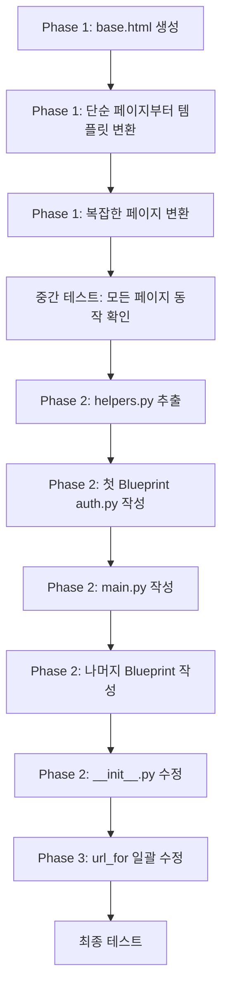

# SCUTTA 리팩터링 가이드

> **목적**: `routes.py` 분리(Blueprint 도입) + 템플릿 상속(base.html) 도입  
> **작업 범위**: Python 라우트, HTML 템플릿, JavaScript fetch URL  
> **예상 소요**: 2~3일 (Phase별 독립 작업 가능)

---

## 현재 구조 요약

| 항목 | 현황 | 문제점 |
|------|------|--------|
| `routes.py` | 3,186줄, 94개 함수, `init_routes(app)` 패턴 | 단일 파일에 모든 기능이 혼재 |
| HTML 템플릿 | 32개 파일, 각각 독립 HTML 문서 | `<head>`, 헤더, 푸터, 네비바가 24+ 파일에 복사 |
| JS 파일 | 17개, `fetch('/경로')` 하드코딩 | Blueprint 도입 시 URL 변경 필요 |

---

## Phase 1: 템플릿 상속 (base.html) 도입

> **이유**: Blueprint 작업 전에 먼저 하는 것을 추천. 템플릿을 먼저 정리하면 나중에 `url_for` 수정 시 한 곳만 고치면 됨.

### 1-1. `base.html` 생성

`app/templates/base.html`을 새로 만들고, 모든 페이지에서 공유하는 요소를 넣습니다.

```html
<!DOCTYPE html>
<html lang="ko">
<head>
    <meta charset="UTF-8">
    <meta name="viewport" content="width=device-width, initial-scale=1.0">
    <title>SCUTTA</title>
    <script src="https://cdn.tailwindcss.com"></script>
    <script src="https://cdnjs.cloudflare.com/ajax/libs/font-awesome/6.5.2/js/all.min.js"></script>
    <link rel="icon" href="{{ url_for('static', filename='favicon.ico') }}" type="image/x-icon">
    <link rel="stylesheet" href="https://cdn.jsdelivr.net/gh/orioncactus/pretendard@v1.3.9/dist/web/static/pretendard.min.css">
    <link rel="stylesheet" href="{{ url_for('static', filename='css/style.css') }}">
    <style>
        body { padding-top: 64px; padding-bottom: 56px; }
        header { position: fixed; top: 0; left: 0; width: 100%; z-index: 20; }
    </style>
    
</head>
<body class="bg-gray-100 text-gray-800">

    {# ===== 상단 헤더 ===== #}
    <header class="bg-white border-b p-4 flex justify-between items-center shadow-sm">
        <div class="flex items-center gap-2 min-w-0">
            
            <div id="menu-toggle" class="text-xl cursor-pointer">&#9776;</div>
            <a href="{{ url_for('main.index') }}" class="text-xl font-bold">SCUTTA</a>
            
        </div>
        <div class="flex-shrink-0 flex items-center gap-2">
            
                <a href="{{ url_for('main.mypage') }}" class="text-sm font-semibold hover:underline truncate hidden sm:block">{{ current_user.username }}</a>
                <a href="{{ url_for('auth.logout') }}" class="bg-gray-200 hover:bg-gray-300 text-sm text-gray-800 py-1 px-2 rounded-md whitespace-nowrap">{{ _('로그아웃') }}</a>
            
                <a href="{{ url_for('auth.login') }}" class="text-sm font-semibold hover:underline">{{ _('로그인') }}</a>
            
        </div>
    </header>

    {# ===== 사이드 메뉴 (index.html에서 가져온 것) ===== #}
    <div id="menu-overlay" class="menu-overlay"></div>
    <div id="menu" class="menu">
        <div class="menu-header">{{ _('메뉴') }}</div>
        <div class="menu-item" onclick="location.href='{{ url_for('main.mypage') }}'">{{ _('마이페이지') }}</div>
        <hr class="my-4" />
        <div class="menu-item" onclick="location.href='{{ url_for('match.submit_match_page') }}'">{{ _('경기 결과 제출') }}</div>
        <div class="menu-item" onclick="location.href='{{ url_for('match.my_submissions') }}'">{{ _('나의 제출 현황') }}</div>
        <div class="menu-item" onclick="location.href='{{ url_for('main.partner') }}'">{{ _('오늘의 상대') }}</div>
        <div class="menu-item" onclick="location.href='{{ url_for('league.league_or_tournament') }}'">{{ _('리그전 및 토너먼트') }}</div>
        <div class="menu-item" onclick="location.href='{{ url_for('betting_bp.betting') }}'">{{ _('베팅') }}</div>
        <hr class="mt-10" />
        <div class="menu-item mt-10">
            <a href="https://www.notion.so/scutta/SCUTTA-66ba5d3097404e0eade61cd7430bd740" target="_blank">NOTION</a>
        </div>
        <div class="menu-item" onclick="location.href='{{ url_for('admin.password') }}'">{{ _('관리 페이지로 이동') }}</div>
    </div>

    {# ===== 플래시 메시지 ===== #}
    <main class="container mx-auto p-4 md:p-6 lg:p-8">
        
            
                <div class="mb-4">
                
                    <div class="p-4 text-sm rounded-lg  bg-red-100 text-red-700  bg-green-100 text-green-700 " role="alert">
                        <span class="font-medium">{{ message }}</span>
                    </div>
                
                </div>
            
        

        
    </main>

    {# ===== 하단 네비게이션 바 ===== #}
    <footer class="bg-white border-t fixed bottom-0 left-0 w-full z-20 h-14">
        <nav class="flex h-full">
            <a href="{{ url_for('main.index') }}" class="w-1/5 flex flex-col items-center justify-center gap-1 transition text-gray-900 font-boldtext-gray-700">
                <i class="fas fa-home fa-lg w-6 text-center"></i>
                <span class="text-xs font-medium">{{ _('홈') }}</span>
            </a>
            <a href="{{ url_for('main.rankings_page') }}" class="w-1/5 flex flex-col items-center justify-center gap-1 transition text-gray-900 font-boldtext-gray-700">
                <i class="fas fa-trophy fa-lg w-6 text-center"></i>
                <span class="text-xs font-medium">{{ _('랭킹') }}</span>
            </a>
            <a href="{{ url_for('league.league_or_tournament') }}" class="w-1/5 flex flex-col items-center justify-center gap-1 transition text-gray-900 font-boldtext-gray-700">
                <i class="fas fa-calendar-days fa-lg w-6 text-center"></i>
                <span class="text-xs font-medium">{{ _('리그전') }}</span>
            </a>
            <a href="{{ url_for('betting_bp.betting') }}" class="w-1/5 flex flex-col items-center justify-center gap-1 transition text-gray-900 font-boldtext-gray-700">
                <i class="fas fa-coins fa-lg w-6 text-center"></i>
                <span class="text-xs font-medium">{{ _('베팅') }}</span>
            </a>
            <a href="{{ url_for('main.mypage') }}" class="w-1/5 flex flex-col items-center justify-center gap-1 transition text-gray-900 font-boldtext-gray-700">
                <i class="fas fa-user-circle fa-lg w-6 text-center"></i>
                <span class="text-xs font-medium">{{ _('마이페이지') }}</span>
            </a>
        </nav>
    </footer>

    <script src="{{ url_for('static', filename='js/script.js') }}"></script>
    
</body>
</html>
```

### 1-2. 제공되는 block 정리

| block 이름 | 용도 | 기본값 |
|------------|------|--------|
| `title` | `<title>` 태그 | `SCUTTA` |
| `extra_head` | 페이지별 추가 CSS/JS (head 안) | 비어있음 |
| `header_left` | 헤더 왼쪽 (페이지 제목 등) | 햄버거 메뉴 + SCUTTA 로고 |
| `content` | 메인 콘텐츠 | 비어있음 |
| `extra_scripts` | 페이지별 추가 JS (body 끝) | 비어있음 |

### 1-3. 자식 템플릿 변환 예시

**현재 `mypage.html` (136줄):**
```html
<!DOCTYPE html>
<html lang="ko">
<head>
    <meta charset="UTF-8">
    <!-- ... 반복되는 <head> 내용 ... -->
</head>
<body>
    <header>...</header>  <!-- 반복 -->
    <div class="container mx-auto">
        <!-- 실제 콘텐츠 -->
    </div>
    <footer>...</footer>  <!-- 반복 -->
    <script src="...script.js"></script>
</body>
</html>
```

**변환 후 `mypage.html` (~70줄):**
```html


{{ _('마이페이지') }} - SCUTTA


    <a href="{{ url_for('main.index') }}" class="text-lg font-bold truncate">
        {{ _('마이페이지') }}
    </a>



    <!-- mypage 고유 콘텐츠만 남김 -->
    <div class="bg-white rounded-lg shadow-sm p-6 mb-6">
        ...
    </div>

```

### 1-4. 특수 페이지 처리

일부 페이지는 `base.html`을 상속하지 않거나, 다른 base를 사용해야 합니다.

| 페이지 | 처리 방법 |
|--------|-----------|
| `login.html` | 상속 안 함 (헤더/푸터 없는 독립 레이아웃) |
| `intro.html` | 상속 안 함 (전혀 다른 풀스크린 레이아웃) |
| `password.html` | 상속 안 함 (관리자 비밀번호 입력 전용) |
| `admin_reset_password.html` | 관리자 전용 - 상속 여부 선택 |

### 1-5. 적용 순서 (추천)

1. `base.html` 작성
2. 가장 단순한 페이지부터 적용: `league_or_tournament.html`, `partner.html`
3. 복잡한 페이지 적용: `index.html`, `settings.html`
4. 브라우저에서 각 페이지 확인 (헤더/푸터/네비바 정상 표시 확인)

### 1-6. 작업 체크리스트

- [ ] `base.html` 생성
- [ ] `league_or_tournament.html` 변환 및 테스트
- [ ] `rankings.html` 변환
- [ ] `mypage.html` 변환
- [ ] `betting.html` 변환
- [ ] `submit_match.html` 변환
- [ ] `submitment.html` 변환
- [ ] `my_submissions.html` 변환
- [ ] `partner.html` 변환
- [ ] `league.html` 변환
- [ ] `league_detail.html` 변환
- [ ] `league_submit_match.html` 변환
- [ ] `tournament.html` 변환
- [ ] `tournament_detail.html` 변환
- [ ] `create_tournament.html` 변환
- [ ] `submit_tournament_results.html` 변환
- [ ] `betting_detail.html` 변환
- [ ] `betting_detail_for_user.html` 변환
- [ ] `betting_detail_admin.html` 변환
- [ ] `create_betting.html` 변환
- [ ] `betting_approval.html` 변환
- [ ] `change_password.html` 변환
- [ ] `approval.html` 변환
- [ ] `assignment.html` 변환
- [ ] `settings.html` 변환
- [ ] `point_history.html` 변환
- [ ] `player_detail_admin.html` 변환
- [ ] `public_player_profile.html` 변환
- [ ] `index.html` 변환 (가장 마지막 - 가장 복잡)
- [ ] 모든 페이지 브라우저 테스트

---

## Phase 2: Blueprint로 routes.py 분리

### 2-1. Blueprint 분리 전략

**기능별 분리**를 추천합니다. 이유:
- 관련 라우트끼리 한 파일에 모이므로 유지보수가 쉬움
- API와 페이지가 같은 기능이면 같은 파일에 있는 게 자연스러움
- URL 접두사를 기능별로 붙일 수 있어 구조가 깔끔

### 2-2. 분리 구조

```
app/
├── __init__.py          # create_app, Blueprint 등록
├── extensions.py        # db, migrate, login_manager, babel
├── models.py            # 모델 (변경 없음)
├── commands.py          # CLI 커맨드 (변경 없음)
├── helpers.py           # [새 파일] 공용 유틸리티 함수
├── routes/              # [새 디렉터리]
│   ├── __init__.py      # 빈 파일 또는 register_blueprints 함수
│   ├── auth.py          # 인증 (로그인/로그아웃/비밀번호)
│   ├── main.py          # 메인 페이지, 랭킹, 프로필, 마이페이지
│   ├── match.py         # 경기 제출/승인/삭제
│   ├── league.py        # 리그 + 토너먼트
│   ├── betting.py       # 베팅
│   ├── admin.py         # 관리자 전용 (설정, 유저 관리, 배정)
│   └── partner.py       # 오늘의 상대
├── static/
└── templates/
```

### 2-3. 각 Blueprint에 들어갈 라우트 목록

#### `auth.py` — Blueprint name: `auth`

| 라우트 | 함수명 | 메서드 |
|--------|--------|--------|
| `/login` | `login` | GET, POST |
| `/logout` | `logout` | GET |
| `/set_language/<lang_code>` | `set_language` | GET |
| `/password` | `password` | GET |
| `/change_password` | `change_password` | POST |
| `/change_password_page` | `change_password_page` | GET |

#### `main.py` — Blueprint name: `main`

| 라우트 | 함수명 | 메서드 |
|--------|--------|--------|
| `/` | `index` | GET |
| `/intro` | `intro` | GET |
| `/rankings_page` | `rankings_page` | GET |
| `/rankings` | `rankings` | GET (API) |
| `/get_my_rank` | `get_my_rank` | GET (API) |
| `/search_players` | `search_players` | GET (API) |
| `/mypage` | `mypage` | GET |
| `/point_history` | `point_history` | GET |
| `/player/<int:player_id>` | `player_detail` | GET |
| `/public_player/<int:player_id>` | (있다면) | GET |
| `/health` | `health_check` | GET |
| `/favicon.ico` | `favicon` | GET |

#### `match.py` — Blueprint name: `match`

| 라우트 | 함수명 | 메서드 |
|--------|--------|--------|
| `/submitment` | `submitment` | GET |
| `/submit_match_direct` | `submit_match_direct` | POST |
| `/submit_match_page` | `submit_match_page` | GET |
| `/my_submissions` | `my_submissions` | GET |
| `/check_players` | `check_players` | POST (API) |
| `/submit_matches` | `submit_matches` | POST (API) |
| `/get_matches` | `get_matches` | GET (API) |
| `/approve_matches` | `approve_matches` | POST (API) |
| `/delete_matches` | `delete_matches` | POST (API) |
| `/select_all_matches` | `select_all_matches` | GET (API) |
| `/get_log_detail/<int:log_id>` | `get_log_detail` | GET (API) |
| `/revert_log` | `revert_log` | POST (API) |
| `/delete_logs` | `delete_logs` | POST (API) |

#### `league.py` — Blueprint name: `league`

| 라우트 | 함수명 | 메서드 |
|--------|--------|--------|
| `/league_or_tournament` | `league_or_tournament` | GET |
| `/league` | `league` | GET |
| `/league/<int:league_id>` | `league_detail` | GET |
| `/league/<int:league_id>/revert` | `revert_league_match` | POST |
| `/create_league` | `create_league` | POST (API) |
| `/save_league/<int:league_id>` | `save_league` | POST (API) |
| `/delete_league/<int:league_id>` | `delete_league` | POST (API) |
| `/league/<int:league_id>/submit/<int:opponent_id>` | `league_submit_match_page` | GET |
| `/league/<int:league_id>/submit_match` | `submit_league_match` | POST |
| `/tournament` | `tournament` | GET |
| `/tournament/create` | `create_tournament_page` | GET |
| `/tournament/generate` | `generate_tournament` | POST |
| `/tournament/<int:tournament_id>` | `tournament_detail` | GET |
| `/tournament/<int:tournament_id>/submit_results` | `submit_tournament_results_page/submit_tournament_results` | GET, POST |
| `/tournament/delete/<int:tournament_id>` | `delete_tournament` | POST |

#### `betting.py` — Blueprint name: `betting_bp`

> ⚠️ 이름을 `betting_bp`로 해야 모델 클래스 `Betting`과 이름 충돌 방지

| 라우트 | 함수명 | 메서드 |
|--------|--------|--------|
| `/betting` | `betting` | GET |
| `/betting/<int:betting_id>/toggle` | `toggle_betting_status` | POST |
| `/betting/<int:betting_id>` | `betting_detail` | GET |
| `/betting/<int:betting_id>/user` | `betting_detail_for_user` | GET |
| `/create_betting` | `create_betting` | POST (API) |
| `/create_betting_page` | `create_betting_page` | GET |
| `/place_bet` | `place_bet` | POST (API) |
| `/submit_betting_result` | `submit_betting_result` | POST (API) |
| `/get_bettings` | `get_bettings` | GET (API) |
| `/delete_bettings` | `delete_bettings` | POST (API) |
| `/select_all_bettings` | `select_all_bettings` | GET (API) |
| `/approve_bettings` | `approve_bettings` | POST (API) |
| `/add_participants` | `add_participants` | POST (API) |
| `/remove_participants` | `remove_participants` | POST (API) |
| `/get_betting_counts` | `get_betting_counts` | POST (API) |
| `/get_players_ranks` | `get_players_ranks` | POST (API) |
| `/betting/<int:betting_id>/delete` | `delete_betting` | POST (API) |
| `/betting/<int:betting_id>/update` | `update_betting` | POST (API) |

#### `admin.py` — Blueprint name: `admin`

| 라우트 | 함수명 | 메서드 |
|--------|--------|--------|
| `/settings` | `settings` | GET |
| `/approval` | `approval` | GET |
| `/betting_approval` | `betting_approval` | GET |
| `/assignment` | `assignment` | GET |
| `/admin/batch_add_users` | `batch_add_users` | POST (API) |
| `/admin/delete_players` | `admin_delete_players` | POST (API) |
| `/recalculate_all_stats` | `recalculate_all_stats` | POST (API) |
| `/admin/reset_password` | `admin_reset_password` | POST (API) |
| `/get_assignment_players` | `get_assignment_players` | GET (API) |
| `/update_player_points` | `update_player_points` | POST (API) |
| `/update_player_rank` | `update_player_rank` | POST (API) |
| `/save_all_assignment_changes` | `save_all_assignment_changes` | POST (API) |
| `/register_players` | `register_players` | POST (API) |
| `/toggle_validity` | `toggle_validity` | POST (API) |
| `/delete_players` | `delete_players` | POST (API) |
| `/get_player_ids` | `get_player_ids` | POST (API) |
| `/update_achievement` | `update_achievement` | POST (API) |

#### `partner.py` — Blueprint name: `partner`

| 라우트 | 함수명 | 메서드 |
|--------|--------|--------|
| `/partner` | `partner` | GET |
| `/reset_partner` | `reset_partner` | POST (API) |
| `/register_partner` | `register_partner` | POST (API) |
| `/submit_partner` | `submit_partner` | POST (API) |

### 2-4. 공용 헬퍼 함수 (`helpers.py`)

현재 `init_routes()` 안에 정의된 유틸리티 함수들을 별도 모듈로 추출합니다.

```python
# app/helpers.py

from .extensions import db
from .models import Player, User, PlayerPointLog, Match
from sqlalchemy import distinct, case, func

def add_point_log(player_id, achieve_change=0, betting_change=0, reason=""):
    """플레이어 포인트 변동 로그 기록"""
    if achieve_change == 0 and betting_change == 0:
        return
    log = PlayerPointLog(
        player_id=player_id,
        achieve_change=achieve_change,
        betting_change=betting_change,
        reason=reason
    )
    db.session.add(log)

def calculate_opponent_count(player_id):
    """상대 수 계산"""
    count = (
        db.session.query(
            func.count(distinct(
                case(
                    (Match.winner == player_id, Match.loser),
                    (Match.loser == player_id, Match.winner)
                )
            ))
        )
        .filter(
            ((Match.winner == player_id) | (Match.loser == player_id)) & (Match.approved == True)
        )
        .scalar()
    )
    return count

def update_player_orders_by_match():
    """경기 기반 순위 업데이트"""
    # ... (routes.py에서 그대로 가져옴)

def update_player_orders_by_point():
    """포인트 기반 순위 업데이트"""
    # ... (routes.py에서 그대로 가져옴)

def get_summary_rankings_data(current_player):
    """랭킹 요약 데이터 조회"""
    # ... (routes.py에서 그대로 가져옴)
```

### 2-5. Blueprint 생성 코드 예시

```python
# app/routes/main.py

from flask import Blueprint, render_template, current_app
from flask_login import login_required, current_user
from ..models import Player, User, Match, League, Betting, TodayPartner
from ..extensions import db
from ..helpers import get_summary_rankings_data

main_bp = Blueprint('main', __name__)

@main_bp.route('/')
@login_required
def index():
    # ... (기존 index 함수 로직 그대로)
    return render_template('index.html', ...)

@main_bp.route('/rankings_page')
@login_required
def rankings_page():
    # ...
    pass
```

### 2-6. `__init__.py` 수정

```python
# app/__init__.py

def create_app():
    app = Flask(__name__)
    # ... (기존 config, extension 초기화)

    # Blueprint 등록
    from .routes.auth import auth_bp
    from .routes.main import main_bp
    from .routes.match import match_bp
    from .routes.league import league_bp
    from .routes.betting import betting_bp
    from .routes.admin import admin_bp
    from .routes.partner import partner_bp

    app.register_blueprint(auth_bp)
    app.register_blueprint(main_bp)
    app.register_blueprint(match_bp)
    app.register_blueprint(league_bp)
    app.register_blueprint(betting_bp)
    app.register_blueprint(admin_bp)
    app.register_blueprint(partner_bp)

    # context_processor & jinja filter는 여기서 등록
    @app.context_processor
    def inject_active_page():
        return dict(active_page=request.endpoint)

    def format_datetime(value, fmt='%Y-%m-%d'):
        if value is None:
            return ""
        korea_time = value.astimezone(ZoneInfo("Asia/Seoul"))
        return korea_time.strftime(fmt)
    app.jinja_env.filters['datetimeformat'] = format_datetime

    # login_manager 설정 (Blueprint 이름 포함)
    login_manager.login_view = 'auth.login'

    commands.register_commands(app)
    return app
```

---

## Phase 3: `url_for` 및 JS fetch URL 업데이트

### 3-1. HTML 템플릿의 `url_for` 변경

Blueprint 도입 후, 모든 `url_for('함수명')`을 `url_for('블루프린트.함수명')`으로 변경해야 합니다.

**변경 예시:**

| 변경 전 | 변경 후 |
|---------|---------|
| `url_for('index')` | `url_for('main.index')` |
| `url_for('login')` | `url_for('auth.login')` |
| `url_for('logout')` | `url_for('auth.logout')` |
| `url_for('mypage')` | `url_for('main.mypage')` |
| `url_for('rankings_page')` | `url_for('main.rankings_page')` |
| `url_for('betting')` | `url_for('betting_bp.betting')` |
| `url_for('league')` | `url_for('league.league')` |
| `url_for('submit_match_page')` | `url_for('match.submit_match_page')` |
| `url_for('settings')` | `url_for('admin.settings')` |
| `url_for('partner')` | `url_for('partner.partner')` |

> **팁**: Phase 1에서 `base.html`을 먼저 만들면, 헤더/푸터의 `url_for`는 한 곳만 고치면 됩니다!

### 3-2. JS 파일의 fetch URL 변경

JavaScript 파일들은 `url_for()`를 사용하지 않고 URL을 하드코딩하고 있습니다. Blueprint에서 `url_prefix`를 사용하지 않으면 (URL을 현재와 동일하게 유지하면) **JS 파일은 수정할 필요 없습니다.**

> [!IMPORTANT]
> **URL을 현재와 동일하게 유지하는 것을 강력히 추천합니다.** 즉, Blueprint의 `url_prefix`를 지정하지 않습니다. 이렇게 하면 JS 수정이 불필요합니다.

만약 `url_prefix`를 사용하기로 결정한 경우, 아래 파일들의 fetch URL을 수정해야 합니다:

| JS 파일 | 하드코딩된 URL |
|---------|---------------|
| `approval.js` | `/approve_matches`, `/delete_matches`, `/select_all_matches` |
| `assignment.js` | `/save_all_assignment_changes` |
| `betting.js` | `get_players_ranks`, `/get_betting_counts`, `/create_betting`, `/betting/{id}/delete` |
| `betting_approval.js` | `/get_bettings`, `/approve_bettings`, `/delete_bettings`, `/select_all_bettings` |
| `betting_detail.js` | `/betting/{id}/update`, `/submit_betting_result`, `/betting/{id}/delete`, `/get_player_ids`, `/add_participants`, `/remove_participants` |
| `betting_detail_admin.js` | `/submit_betting_result` |
| `create_betting.js` | `/create_betting` |
| `index.js` | `/get_my_rank`, `/search_players`, `/rankings` |
| `league.js` | `/create_league` |
| `league_detail.js` | `/save_league/{id}`, `/submit_matches`, `/delete_league/{id}` |
| `settings.js` | `/admin/batch_add_users`, `/admin/delete_players`, `/reset_partner`, `/register_partner`, `/submit_partner` |
| `submit_match.js` | `/submit_matches` |
| `submitment.js` | `/get_matches` |
| `tournament_detail.js` | `/tournament/delete/{id}` |

### 3-3. routes.py 내부의 `url_for`, `redirect` 변경

Python 코드 안에서도 `url_for('함수명')`을 사용하는 부분이 있습니다. 같은 Blueprint 내부의 라우트를 참조할 때는 `.함수명` 형태로 쓸 수 있습니다:

```python
# 같은 Blueprint 내부 -> 상대 참조
return redirect(url_for('.index'))

# 다른 Blueprint -> 절대 참조
return redirect(url_for('auth.login'))
```

---

## 실전 작업 순서 (추천)



### 단계별 체크리스트

**Day 1: 템플릿 상속**
- [ ] `base.html` 작성
- [ ] 간단한 페이지 3~5개 변환 후 테스트
- [ ] 나머지 페이지 변환
- [ ] 전체 페이지 브라우저 테스트

**Day 2: Blueprint 분리**
- [ ] `app/helpers.py` 작성 (공용 함수 추출)
- [ ] `app/routes/` 디렉터리 생성
- [ ] `auth.py` 작성 (가장 단순)
- [ ] `main.py` 작성
- [ ] `match.py` 작성
- [ ] `league.py` 작성
- [ ] `betting.py` 작성
- [ ] `admin.py` 작성
- [ ] `partner.py` 작성
- [ ] `__init__.py` 수정
- [ ] `login_manager.login_view` 업데이트

**Day 3: URL 수정 + 테스트**
- [ ] 모든 HTML의 `url_for()` 업데이트
- [ ] `base.html`의 `url_for()` 업데이트
- [ ] Python 코드의 `url_for()`, `redirect()` 업데이트
- [ ] (필요 시) JS fetch URL 업데이트
- [ ] 전체 기능 테스트

---

## 주의사항

### 1. `context_processor`와 Jinja 필터

`inject_active_page()`와 `format_datetime()`은 전역으로 필요하므로 `__init__.py`의 `create_app()`에서 등록해야 합니다. 개별 Blueprint에 등록하면 해당 Blueprint의 라우트에서만 동작합니다.

### 2. `active_page` 값 변경

Blueprint 도입 후 `request.endpoint` 값이 `'index'`에서 `'main.index'`로 바뀝니다. `base.html`의 네이바 하이라이팅 조건도 이에 맞게 수정해야 합니다.

### 3. import 경로

Blueprint 파일에서의 import:
```python
# app/routes/main.py 에서
from ..models import Player, User  # 상위 패키지의 models
from ..extensions import db        # 상위 패키지의 extensions
from ..helpers import add_point_log # 상위 패키지의 helpers
```

### 4. 순환 import 방지

- models, extensions는 항상 최상위에서 import
- Blueprint 간 함수 호출이 필요하면 `helpers.py`를 경유
- Blueprint 파일에서 다른 Blueprint를 직접 import하지 않기

### 5. Flask-Babel 번역

Blueprint 분리 후에도 `_()`, `ngettext()` 등 번역 함수는 동일하게 사용 가능합니다. `from flask_babel import _`로 각 Blueprint에서 import하면 됩니다.

### 6. 테스트 방법

각 Phase 완료 후 반드시 아래를 확인하세요:

```bash
# 앱 실행
flask run

# 확인 항목
# 1. 로그인 페이지 접속
# 2. 메인 대시보드 (/) 정상 표시
# 3. 하단 네비바 5개 탭 모두 클릭하여 이동 확인
# 4. 사이드 메뉴(햄버거) 열기/닫기
# 5. 랭킹 페이지에서 무한 스크롤 동작
# 6. 경기 결과 제출 폼 동작
# 7. 관리자 로그인 후 설정 페이지 접속
# 8. 베팅 생성/참여 동작
```

---

## 빠른 참조: 파일 → Blueprint 매핑

| HTML 템플릿 | 렌더링하는 라우트 | Blueprint |
|-------------|------------------|-----------|
| `index.html` | `index()` | `main` |
| `intro.html` | `intro()` | `main` |
| `login.html` | `login()` | `auth` |
| `rankings.html` | `rankings_page()` | `main` |
| `mypage.html` | `mypage()` | `main` |
| `point_history.html` | `point_history()` | `main` |
| `player_detail_admin.html` | `player_detail()` | `main` |
| `public_player_profile.html` | (있다면) | `main` |
| `submit_match.html` | `submit_match_page()` | `match` |
| `submitment.html` | `submitment()` | `match` |
| `my_submissions.html` | `my_submissions()` | `match` |
| `league_or_tournament.html` | `league_or_tournament()` | `league` |
| `league.html` | `league()` | `league` |
| `league_detail.html` | `league_detail()` | `league` |
| `league_submit_match.html` | `league_submit_match_page()` | `league` |
| `tournament.html` | `tournament()` | `league` |
| `tournament_detail.html` | `tournament_detail()` | `league` |
| `create_tournament.html` | `create_tournament_page()` | `league` |
| `submit_tournament_results.html` | `submit_tournament_results_page()` | `league` |
| `betting.html` | `betting()` | `betting_bp` |
| `betting_detail.html` | `betting_detail()` | `betting_bp` |
| `betting_detail_for_user.html` | `betting_detail_for_user()` | `betting_bp` |
| `betting_detail_admin.html` | (betting_detail 의 관리자 버전) | `betting_bp` |
| `create_betting.html` | `create_betting_page()` | `betting_bp` |
| `betting_approval.html` | `betting_approval()` | `admin` |
| `approval.html` | `approval()` | `admin` |
| `assignment.html` | `assignment()` | `admin` |
| `settings.html` | `settings()` | `admin` |
| `admin_reset_password.html` | `admin_reset_password()` | `admin` |
| `password.html` | `password()` | `auth` |
| `change_password.html` | `change_password_page()` | `auth` |
| `partner.html` | `partner()` | `partner` |
